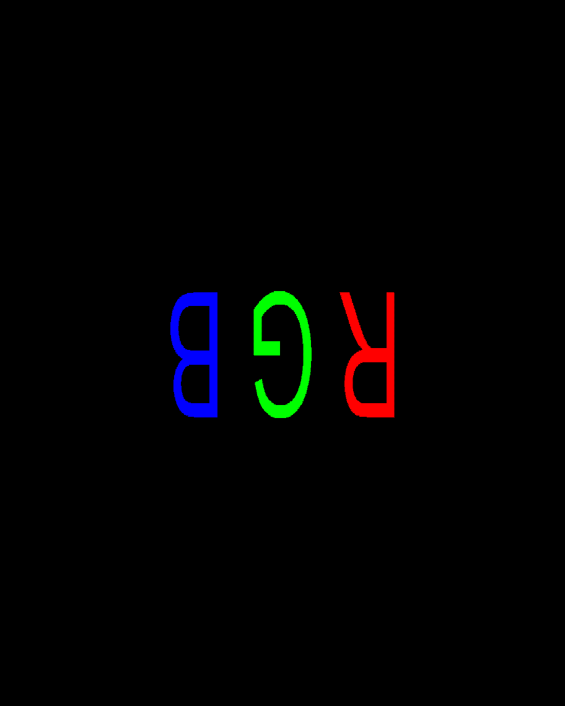

# DMD-pattern-generator
Generate calibration patterns for projector-based structured light system.
The code is developed with python3.10 and tested on windows 10 and 11.

## Dependencies
First, install dependencies, open a terminal under the project directory and run: 
```
pip3 install -r requirements.txt
```
It is recommended to use a [virtual environment](https://docs.python.org/3/tutorial/venv.html) or [conda environment](https://docs.conda.io/projects/conda/en/latest/user-guide/tasks/manage-environments.html) for running this code.

## Usage
There are two operating modes:
* Generating patterns from modified template
* Generating patterns programmatically

### 1. Generating patterns from an modified template
In this mode, the program accepts a modfied template file and generates patterns based on the template. The template file is a bmp file with usable area of DMD marked in black/white and the surrounding marked in red, which labels the real space pixel status.

The template file can be modified to add different patterns on the usable area of DMD. The program will generate patterns based on the modified template file. The generated patterns in the DMD coordinate space will be saved as a bmp file.

An example of the template file is shown below:


The template is the *real-space* frame, where the black area is the usable area of DMD and the red area is the surrounding area.
The 45 degree placement is to accommodate the pixel orientation of the DMD.

The corresponding DMD frame is shown below:



The pattern in DMD frame has different aspect ratio compared to the real-space frame due to the pixel indexing of the DMD.

The template file can be modified in any image editing software to reflect the desired pattern on the DMD.

To generate pattern with a modified template, open a terminal window under the project folder and run 
```
python3 main.py
```
use the pop-up window to select modified template file, and the generated patterns will be saved in the same directory as the template file.

### 2. Generating patterns programmatically
There are a few pre-defined classes written in [utils](utils) module for drawing patterns on real-space frame and transform the pattern to DMD frame for projection. 
- [utils/frame.py](utils/frame.py): `Frame` class defines the coordinate system and transformation between real-space and DMD frame. The class has a method `drawPattern` to update the real-space frame with the pattern. There are inherited classes `BinaryFrame`, `ColorFrame` and `GrayscaleFrame` for RGB and grayscale pattern respectively.
- [utils/painter.py](utils/painter.py): `Painter` class defines methods to generate coordinates of the pattern in real-space frame. There are inherited class `GrayscalePainter` for painting grayscale pattern with intensity.

To demonstrate the use of the modules, there are a few notebooks:
- [DMD_RGB_pattern_generation.ipynb](DMD_RGB_pattern_generation.ipynb)
- [DMD_grayscale_pattern_generation.ipynb](DMD_grayscale_pattern_generation.ipynb)
- [DMD_sequence_generation.ipynb](DMD_sequence_generation.ipynb)

The structure of the code is as follows:
- Coordinate system is defined in class `Frame`, which has two attributes: Real-space array `real_frame` and DMD array `dmd_frame`. The coordinate transformation between real-space and DMD is defined in a method `realSpace(row, col)`. The `Frame` class also has a method `drawPattern(pattern, color)` to accept an array of coordinates and update those pixels with draw color on the real-space frame and reflect the changes to the DMD-space frame.
- Pattern painter is defined in class `Painter`. It contains multiple methods to output an array of coordinates of the pattern in real-space frame.
- For grayscale pattern, error diffusion is required to generate binary approximation. The error diffusion is implemented in class `Dither` with different static methods. To draw grayscale pattern, another painter class `GrayscalePainter` is defined to generate coordinates of pixels and their corresponding intensity.
- A sequence of binary patterns can be generated by class `BinarySequence`. The sequence is defined by a list of patterns. The sequence can be packed to a list of `ColorFrame` objects with specific bit-plane mapping and save as a series of bmp files.